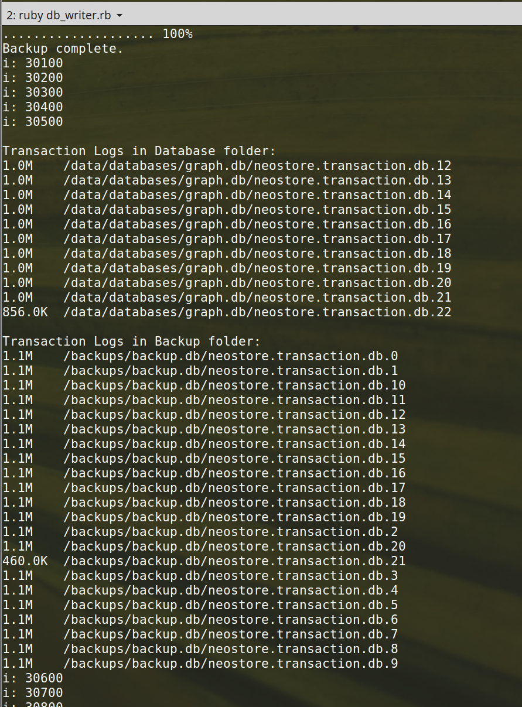

# Neo4j transaction log build up

The purpose of this project is to demonstrate the transaction log build up issue when taking incremental backups.

## Incremental backups do not clean up tx log files and eats up disk space fast!

I discovered after starting to use nightly incremental backups that the older tx log files do not get cleaned up
so each incremental backup adds all the tx log files since the last incremental backup growing the size of the backup directory _very_ quickly.

These are the transaction log files that get rotated and cleaned up in your database as specified by the log retention policy and tx log size configuration parameters (and a few others).

The size of our backups more than doubled in the span of 5 days (these are sent each night to S3 so there is cost component to storing extra data).

* **Neo4j Version:** 3.3.1-enterprise
* **Operating System:** (Docker) The official Neo4j image which uses `openjdk:8-jre-alpine` as its base.

### Steps to reproduce

We can demonstrate the log buildup issue using this project. (Est time ~ 10-15 minutes).

* This projects require you have `docker` and `docker-compose` installed for your platform and expects you can run a `bash` terminal in the repo's root directory.

* If you do not have `6 GB` of RAM to give to Neo4j I recommend reducing the page cache and heap size in
the `docker-compose.yml` environment configuration to `1G` and `2G` respectively.

* Ensure you are not running any Neo4j instances locally and ports `7474` and `7687` are open for use.

* Ensure you have `ruby` >= `2.3.3` installed. Run:
    ```sh
    # If you don't have bundle, gem install bundle
    bundle install
    ```

* Start Neo4j in one terminal window by running
    ```sh
    docker-compose up
    ```

* Now run the `db_writer.rb` script which will start making transactions (just creating a linked list of numbers in Neo4j).

    ```sh
    ruby db_writer.rb
    ```

    Every `5000` transactions this will use `docker-compose` to take an incremental backup and `500` transactions later print the current transaction logs in the live database data directory and then in the backup directory.

* After you reach `i: 20000` (or sooner) you should start seeing that in the database folder the tx logs are getting rotated and pruned as we expect. But the just hang around in the backup folder.

    

### Expected behavior
The size of the backup directory should be consistent with the database data directory. Old tx logs should be removed.

### Actual behavior
The size of the backups increases by _# tx logs since last backup_ X _tx log size_ on each incremental backup.

All tx logs since starting incremental backups are still in the backup directory. This is very problematic for write heavy applications using Neo4j.
